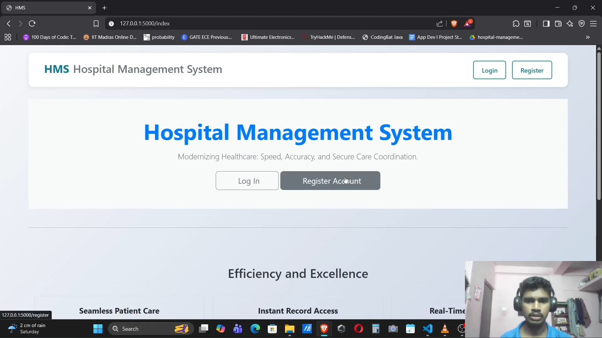
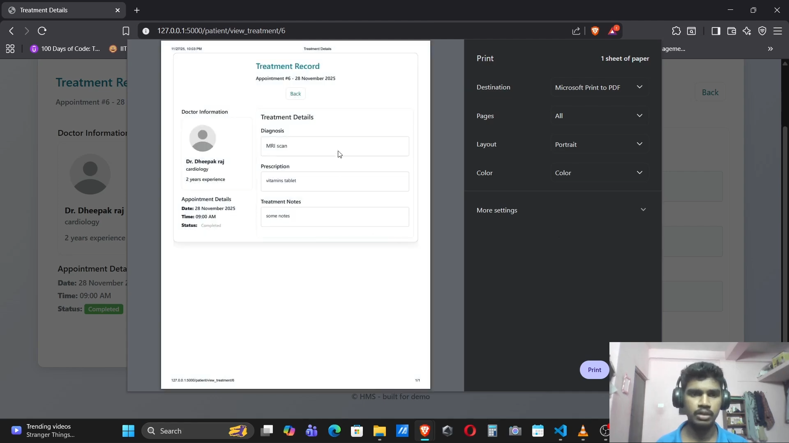
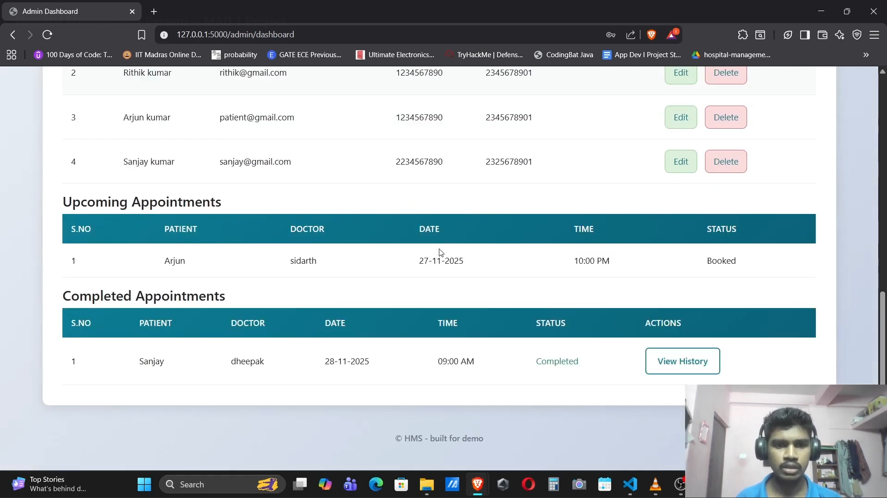
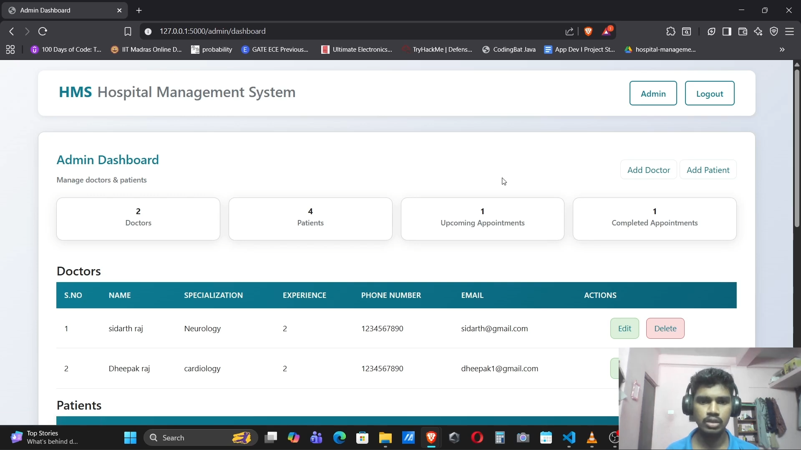

# 🏥 Hospital Management System (MAD-1)

A web-based Hospital Management System developed using **Flask** following a modular architecture. The system enables **Admins, Doctors, and Patients** to efficiently manage appointments, treatment records, doctor availability, and hospital resources through role-based access control.

> Developed as part of the IIT Madras BS in Data Science – Modern Application Development I course.

---

## Features

- Multi-role authentication (Admin, Doctor, Patient)
- Secure user login and session management
- Appointment booking and cancellation
- Doctor availability management
- Treatment and medical record management
- Department management
- Responsive Bootstrap UI

---

## Tech Stack

### Backend
- Python
- Flask
- SQLAlchemy
- Flask-Login

### Frontend
- HTML
- Bootstrap
- Jinja2

### Database
- SQLite

---

## Screenshots

### Login Page


---

### Admin Dashboard






## Project Structure

```text
app.py
models/
routes/
templates/
static/
```

---

## Installation

```bash
git clone <repo-url>

cd Hospital-Management-System

pip install -r requirements.txt

python app.py
```

---

## Documentation

📄 Full project report:

**MAD-1_Project_Report.pdf**

---

## Demo

🎥 Add your project demo GIF or video here.

---

## Author

**Dheepak D**

- LinkedIn: https://linkedin.com/in/devarajdheepakchakaravathi
- GitHub: https://github.com/DHEER-A
